# 🚀 DevOps CI/CD Project V2 – Production-Style Secure Deployment

## 📌 Project Overview

This project demonstrates a production-style CI/CD pipeline using:

- GitHub Actions
- Docker
- Amazon ECR
- AWS EC2
- AWS Systems Manager (SSM)
- IAM Roles & Secure Access Control
- Immutable Image Tagging using Commit SHA

### 🔑 Key Highlights

✅ Deployment without SSH  
✅ No Port 22 exposed  
✅ Fully managed via AWS Systems Manager (SSM)  
✅ Immutable Docker image tagging (Commit SHA)  
✅ Secure IAM-based authentication  
✅ Infrastructure cleaned up after demonstration (Cost-optimized)

---

# 🏗 Architecture

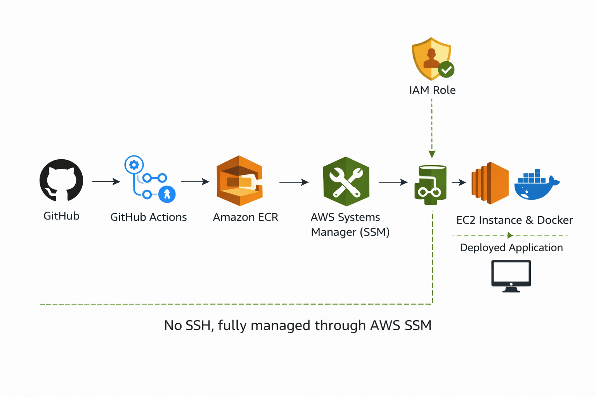

## 📁 Project Structure
```
devops-ci-cd-project-v2/
│
├── .dockerignore # # Prevents unnecessary files in Docker image
├── Dockerfile # Container definition
├── app.py # Flask application
├── requirements.txt # Python dependencies
├── README.md # Project documentation
│
└── docs/
├── architecture/
│ └── 00-ssm-based-ci-cd-architecture-diagram.png
│
└── screenshots/
├── CI/CD workflow evidence
├── IAM configuration
├── EC2 & security setup
├── SSM execution logs
└── Deployment proof
```

### 🔄 Pipeline Flow

GitHub → GitHub Actions → Amazon ECR → AWS SSM → EC2 → Docker → Live Application

---

# ⚙️ CI/CD Workflow

When code is pushed to the `main` branch:

1. GitHub Actions workflow triggers automatically
2. Docker image is built
3. Image tagged using `${{ github.sha }}`
4. Image pushed to Amazon ECR
5. AWS SSM Run Command executes deployment on EC2
6. EC2 pulls the specific SHA image
7. Container restarted with new version

---

## 📷 GitHub Actions Evidence

### Repository Overview

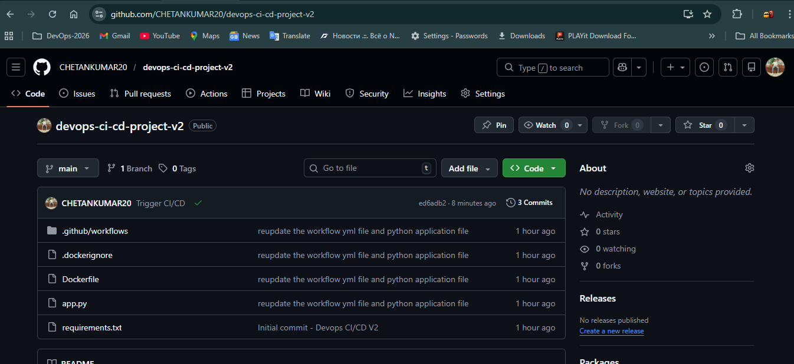

### Workflow Configuration

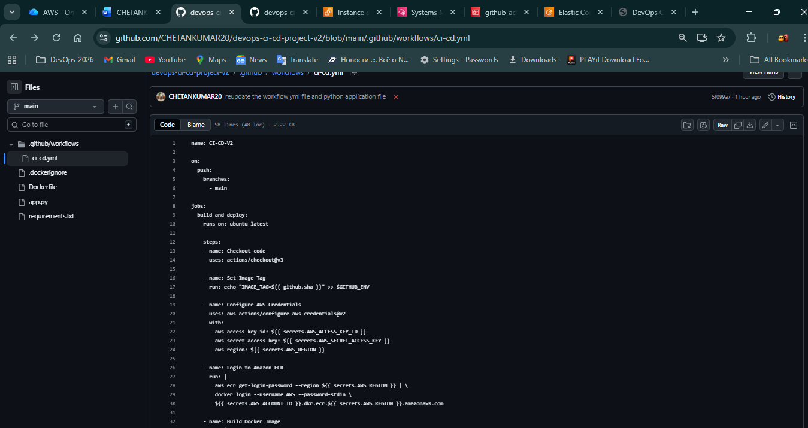

### Successful Run

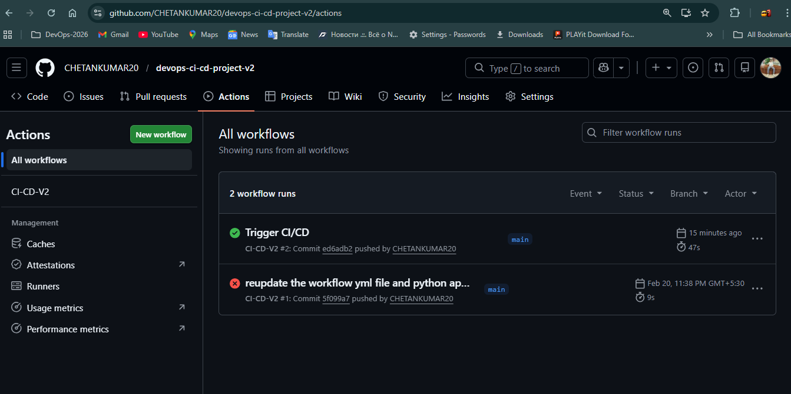

### Final Deployment Run

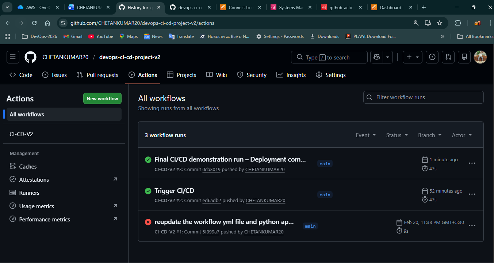

---

# 🐳 Immutable Image Tagging Strategy

Instead of using the `latest` tag, images were tagged using: `${{ github.sha }}`

This ensures:

- Full traceability
- Easy rollback capability
- Reproducible deployments
- No accidental overwrites

### ECR Evidence

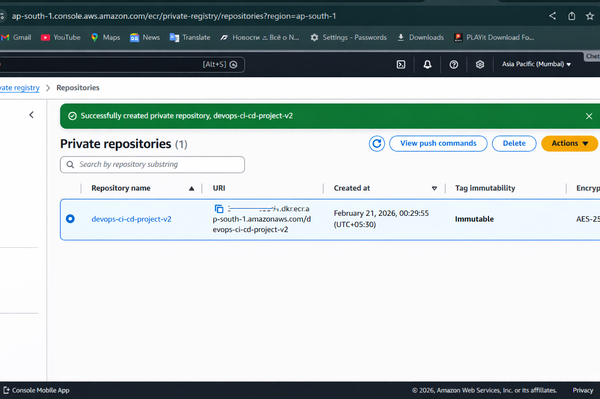
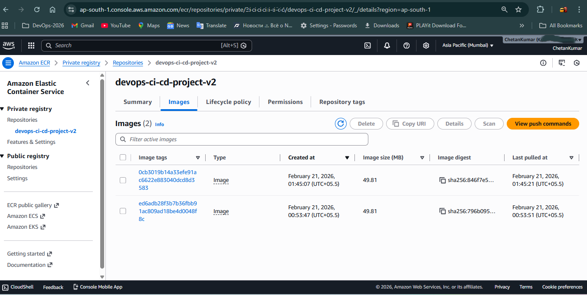

---

# 🔐 Security Architecture (No SSH)

This project avoids traditional SSH-based deployments.

### Improvements Implemented:

❌ No SSH keys used  
❌ No port 22 exposed  
✅ Used AWS Systems Manager Run Command  
✅ EC2 attached with IAM Role  
✅ GitHub uses IAM user with limited permissions  

### IAM Role Evidence

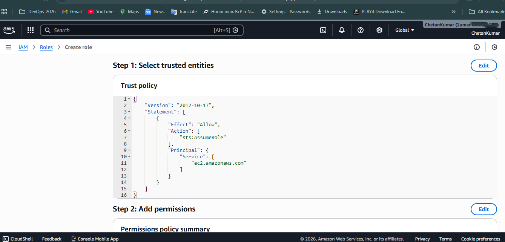
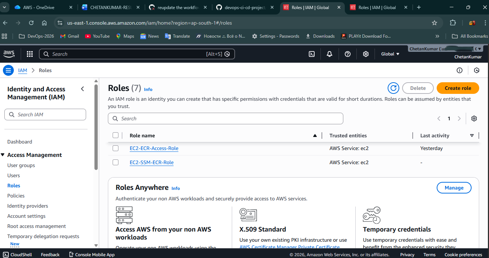
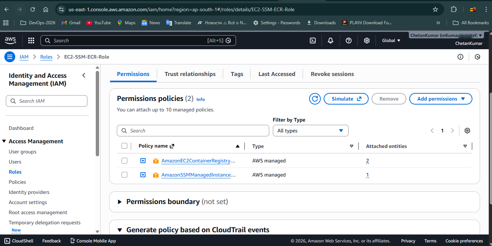

### GitHub IAM User Permissions

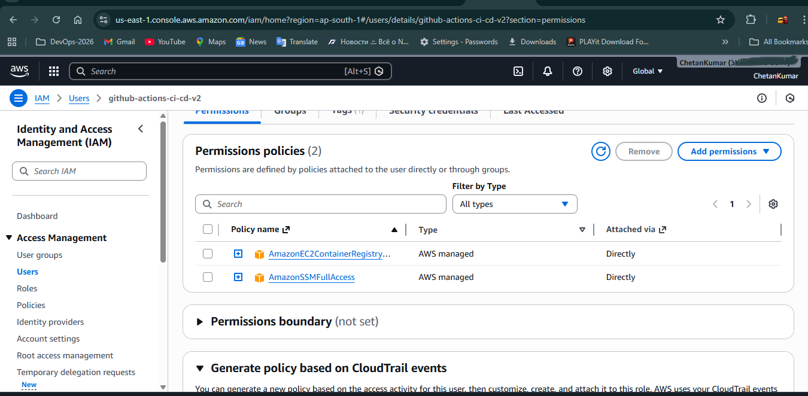

### Security Group Configuration

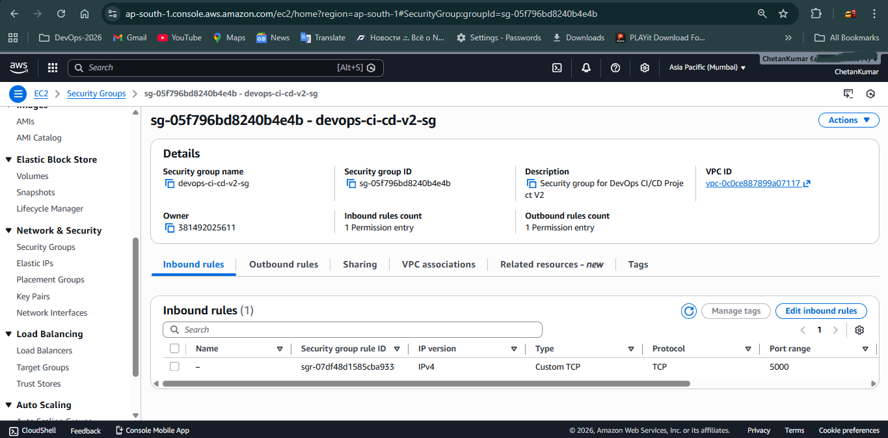

---

# 🖥 Deployment Proof

### EC2 Configuration

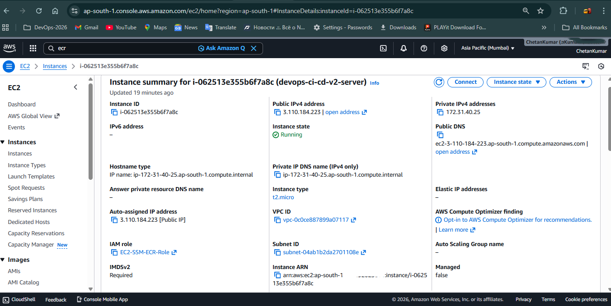

### SSM Session Connection

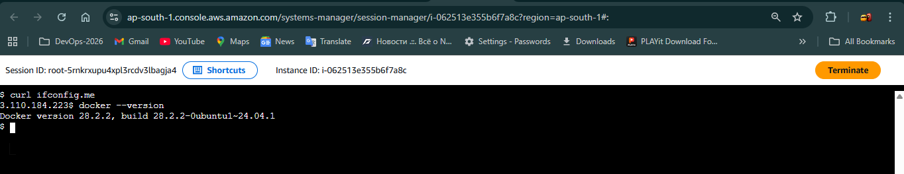

### SSM Command Execution

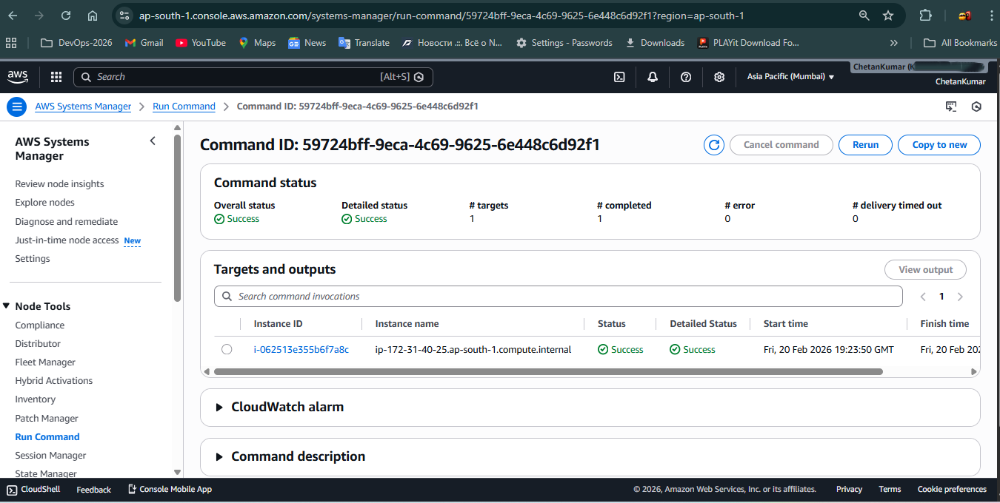
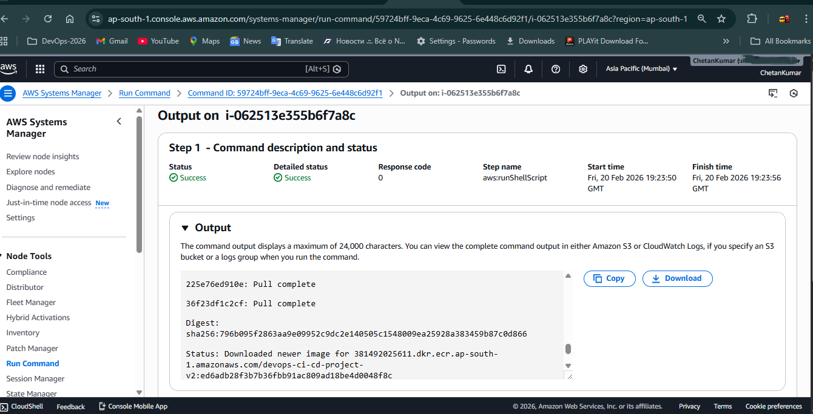
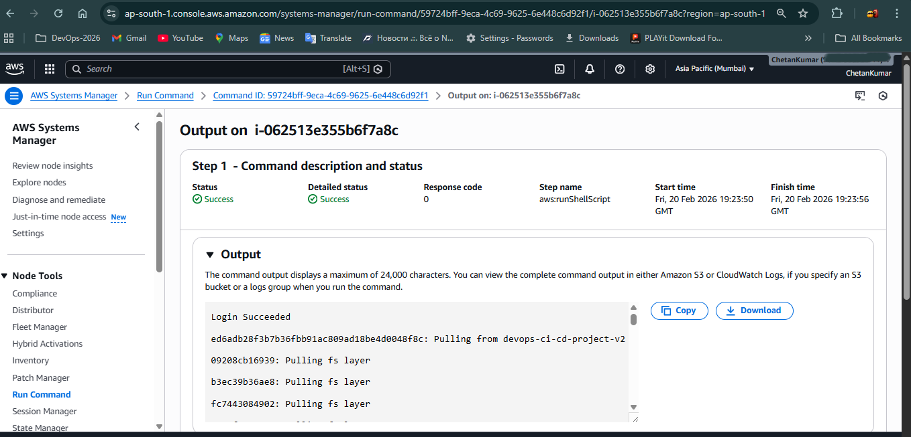

### Docker Container Running

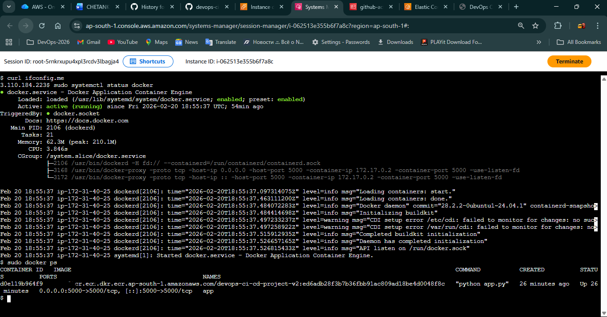

### Live Application

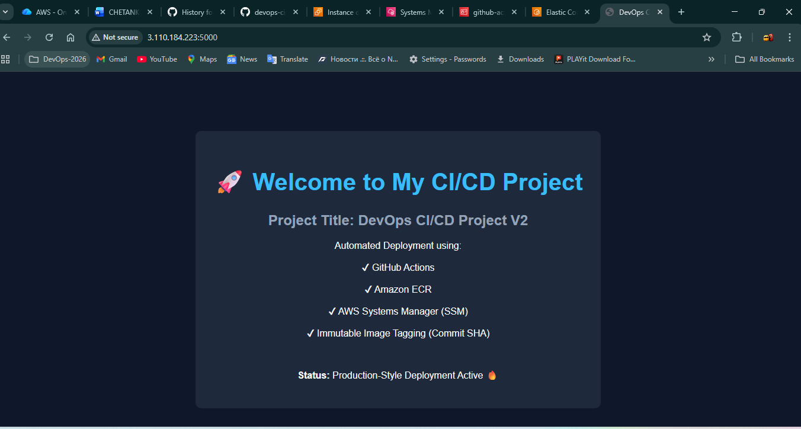

---

# ⚠️ Issues Faced & How They Were Resolved

## 1️⃣ SSM Agent Showing Offline

**Issue:**  
EC2 instance showed Session Manager "Offline" status.

**Cause:**  
Instance launched in incorrect subnet without public IP assignment.

**Resolution:**  
- Relaunched instance in default public subnet  
- Enabled auto-assign public IP  
- Attached correct IAM role  

---

## 2️⃣ AWS CLI Not Installed on EC2

**Issue:**  
`aws: command not found`

**Resolution:**  
Installed AWS CLI v2 using official installer:

curl https://awscli.amazonaws.com/awscli-exe-linux-x86_64.zip
 -o awscliv2.zip
unzip awscliv2.zip
sudo ./aws/install


---

## 3️⃣ Docker Not Found

**Issue:**  
`docker: command not found`

**Resolution:**  
Installed Docker:

sudo apt install docker.io -y


Added ubuntu user to docker group and reconnected session.

---

## 4️⃣ SSM Command Formatting Errors in GitHub Actions

**Issue:**  
Multiline string formatting caused SSM deployment failure.

**Resolution:**  
Used JSON array format for the `commands` parameter inside `aws ssm send-command`.

---

## 5️⃣ Unexpected AWS Charges (EKS & NAT Gateway)

**Issue:**  
Small billing charge appeared in AWS bill.

**Cause:**  
Earlier testing with:
- EKS cluster
- NAT Gateway
- t3.medium instance

**Resolution:**  
- Avoided NAT Gateway usage
- Avoided EKS for basic CI/CD demo
- Used public subnet EC2 only
- Deleted all resources after showcase
- Verified billing returned to $0

---

# 💰 Cost Optimization Approach

- Used Free Tier instance (t2.micro)
- Avoided NAT Gateway
- Avoided EKS
- Deleted EC2 after demonstration
- Deleted ECR images
- Released Elastic IP
- Verified billing console

---

# 🎯 Final Outcome

✔ Secure deployment without SSH  
✔ Immutable deployment strategy  
✔ IAM-based secure automation  
✔ Production-style pipeline  
✔ Fully documented with evidence  
✔ Cost-optimized infrastructure  


## 📌 Infrastructure Decommissioning & Workflow Strategy

After successfully validating the CI/CD pipeline and capturing deployment evidence, the AWS infrastructure (EC2, ECR, related networking resources) was intentionally decommissioned.

This was done to:
- Prevent unnecessary AWS costs  
- Maintain a clean cloud environment  
- Follow responsible cost management practices  

The main deployment workflow (`ci-cd.yml`) has been temporarily disabled by renaming it:

`ci-cd.yml` was renamed to `ci-cd.yml.disabled`

This ensures:
- The pipeline does not attempt AWS deployments
- No failing workflows appear in the repository
- Infrastructure can be recreated and re-enabled when required

When needed, the workflow can be restored simply by renaming the file back to:

`ci-cd.yml`

---

### 🟢 Repository Health Workflow

Since the infrastructure is decommissioned, a lightweight workflow is maintained to:

- Validate commits
- Ensure GitHub Actions remains green
- Provide clean repository activity history

This workflow runs on every commit and confirms repository status without triggering deployment steps.  


`📍 This project was built for hands-on learning and production-style deployment practice.`


# 👤 Author. 

**Chetan Kumar**. 
Cloud & DevOps Engineer. 
CI/CD | Docker | AWS | Infrastructure Automation. 

